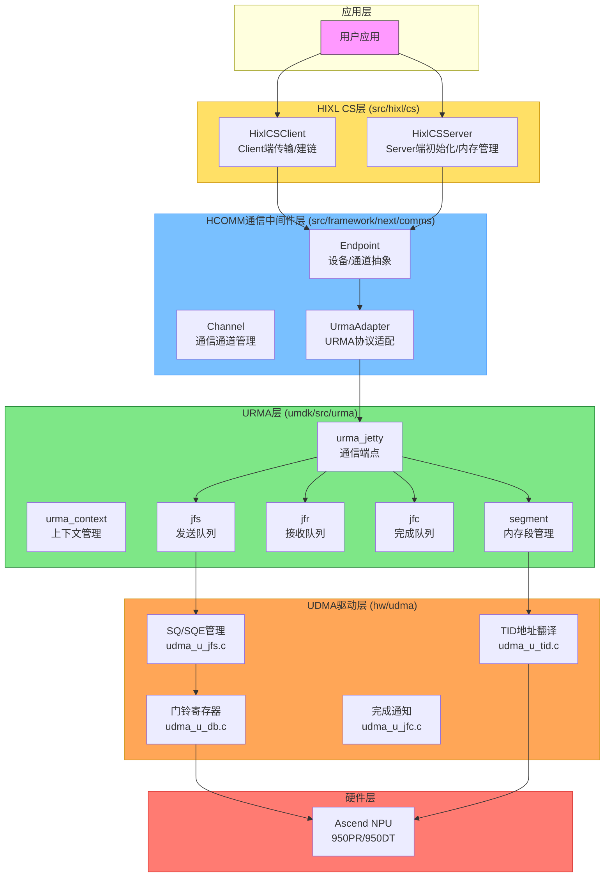
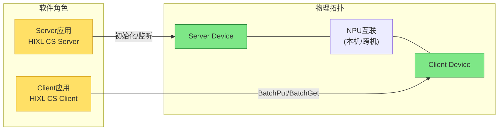
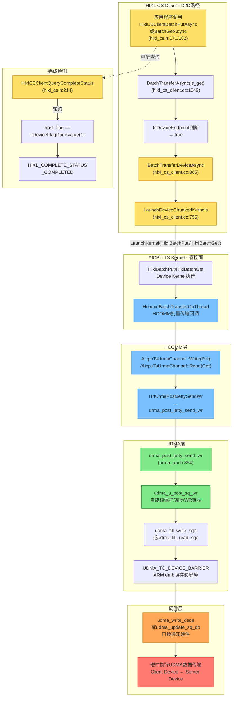
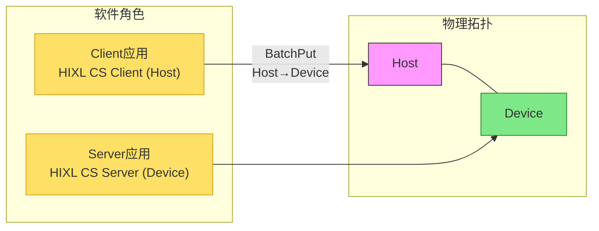
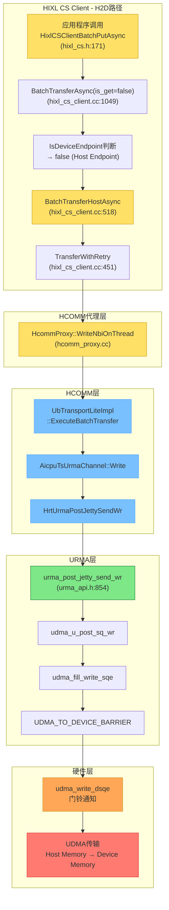
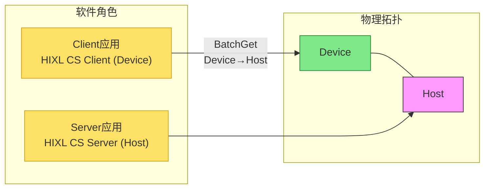
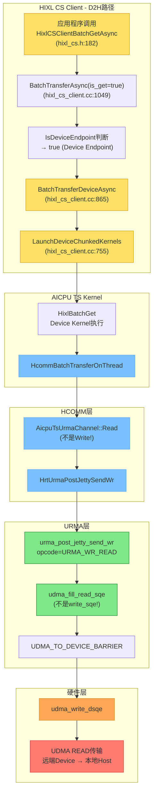

# HIXL URMA API 全流程文档 v2.0 - D2D、H2D、D2H

**文档版本**: v2.0
**最后更新**: 2026-05-30
**产品支持**: Ascend 950PR / Ascend 950DT (A5代际)
**协议**: UBC_CTP (华为统一总线CTP协议)
**前置分析**: [memory.md](file:///m:/repo/trae1/memory.md)

---

## 目录

1. [文档概述与架构说明](#1-文档概述与架构说明)
2. [总体架构调用链](#2-总体架构调用链)
3. [三种通信模式对比](#3-三种通信模式对比)
4. [D2D模式完整流程](#4-d2d模式完整流程)
5. [H2D模式完整流程](#5-h2d模式完整流程)
6. [D2H模式完整流程](#6-d2h模式完整流程)
7. [公共API详细说明](#7-公共api详细说明)
8. [错误码与解决方案](#8-错误码与解决方案)
9. [完整代码示例](#9-完整代码示例)

---

## 1. 文档概述与架构说明

### 文档概述

本文档详细描述了HIXL基于URMA的三种通信模式的完整业务流程：

- **D2D**: Device-to-Device - Device间直接通信
- **H2D**: Host-to-Device - Host到Device的数据传输
- **D2H**: Device-to-Host - Device到Host的数据传输

### 架构层次



### 关键架构说明

| 层级 | 说明 | 协议无关性 |
|------|------|-----------|
| **HIXL CS** | 对外API层，管理Server/Client生命周期，内存注册与数据传输入口 | 协议无关，通过HCOMM代理分发 |
| **HCOMM** | 通信中间件，通过adapter模式支持URMA、HCCP等多种协议 | **含URMA/HCCP适配器** |
| **URMA** | 华为统一RDMA API，提供PUT/GET语义 | UBC_CTP专用 |
| **UDMA** | 用户态DMA驱动，直接操作硬件门铃寄存器 | UBC_CTP专用 |

> **关于HCCP**: HIXL中存在`HccpProxy`但仅用于RoCE notify地址解析(`RaGetNotifyAddrLen`)。HCOMM内部有`adapter_hccp`用于其他协议。对于UBC_CTP协议，调用链走URMA路径，**不经过HCCP**。

> **关于本机/跨机**: 软件层调用链完全一致，差异仅在硬件传输路径（本机: 芯片直连，跨机: 网络交换），本文档不再区分。

---

## 2. 总体架构调用链

### 2.1 全链路调用块关系

```mermaid
graph LR
    A1["HIXL API<br/>BatchPutAsync<br/>BatchGetAsync"] --> B1["HIXL内部转发<br/>BatchTransferAsync"]
    B1 --> C1{"Endpoint类型判断"}
    C1 -->|"Device Endpoint"| D1["BatchTransferDeviceAsync<br/>→ LaunchDeviceChunkedKernels"]
    C1 -->|"Host Endpoint"| D2["BatchTransferHostAsync<br/>→ HcommProxy调用"]

    D1 --> E1["AICPU TS Kernel<br/>HcommBatchTransferOnThread"]
    D2 --> E2["Host线程<br/>HcommProxy::WriteNbiOnThread"]

    E1 --> F1["HCOMM Channel<br/>AicpuTsUrmaChannel::Write/Read"]
    E2 --> F1

    F1 --> G1["URMA API<br/>urma_post_jetty_send_wr"]
    G1 --> H1["UDMA驱动<br/>udma_u_post_sq_wr"]
    H1 --> I1["门铃通知<br/>udma_write_dsqe"]
    I1 --> J1["硬件传输<br/>Ascend NPU"]

    style A1 fill:#ffe066,stroke:#d4a017
    style B1 fill:#ffe066,stroke:#d4a017
    style C1 fill:#ffe066,stroke:#d4a017
    style D1 fill:#ffe066,stroke:#d4a017
    style D2 fill:#ffe066,stroke:#d4a017
    style E1 fill:#79c0ff,stroke:#58a6ff
    style E2 fill:#79c0ff,stroke:#58a6ff
    style F1 fill:#79c0ff,stroke:#58a6ff
    style G1 fill:#7ee787,stroke:#238636
    style H1 fill:#ffa657,stroke:#d29922
    style I1 fill:#ffa657,stroke:#d29922
    style J1 fill:#ff7b72,stroke:#da3633
```



### 2.2 三种模式的Endpoint配置

| 模式 | Client Endpoint类型 | Server Endpoint类型 | 分发路径 | 传输操作 |
|------|--------------------|--------------------|---------|---------|
| **D2D** | `ENDPOINT_LOC_TYPE_DEVICE` | `ENDPOINT_LOC_TYPE_DEVICE` | DeviceAsync | Put/Get |
| **H2D** | `ENDPOINT_LOC_TYPE_HOST` | `ENDPOINT_LOC_TYPE_DEVICE` | HostAsync | Put |
| **D2H** | `ENDPOINT_LOC_TYPE_DEVICE` | `ENDPOINT_LOC_TYPE_HOST` | DeviceAsync | Get |

### 2.3 控制面初始化调用链

```mermaid
graph TB
    subgraph Server初始化
        S1["HixlCSServerCreate<br/>(hixl_cs.h:78)"] --> S2["HcommEndpointCreate<br/>ENDPOINT_LOC_TYPE_DEVICE"]
        S2 --> S3["urma_create_context<br/>(urma_cp_api.c)"]
        S3 --> S4["urma_register_segment<br/>(urma_cp_api.c)"]
        S4 --> S5["HixlCSServerListen<br/>(hixl_cs.h:98)"]
    end

    subgraph Client初始化
        C1["HixlCSClientCreate<br/>(hixl_cs.h:122)"] --> C2["HcommEndpointCreate<br/>根据模式选择类型"]
        C2 --> C3["urma_create_context"]
        C3 --> C4["HixlCSClientRegMem<br/>(hixl_cs.h:153)"]
        C4 --> C5["urma_register_segment"]
        C5 --> C6["HixlCSClientConnect<br/>(hixl_cs.h:131)"]
        C6 --> C7["HcommChannelCreate<br/>AicpuTsUrmaChannel"]
        C7 --> C8["urma_create_jetty<br/>(urma_cp_api.c:1636)"]
        C8 --> C9["HixlCSClientGetRemoteMem<br/>(hixl_cs.h:142)"]
    end

    style S1 fill:#ffe066,stroke:#d4a017
    style S5 fill:#ffe066,stroke:#d4a017
    style C1 fill:#ffe066,stroke:#d4a017
    style C9 fill:#ffe066,stroke:#d4a017
    style S2 fill:#79c0ff,stroke:#58a6ff
    style C2 fill:#79c0ff,stroke:#58a6ff
    style C7 fill:#79c0ff,stroke:#58a6ff
    style S3 fill:#7ee787,stroke:#238636
    style C3 fill:#7ee787,stroke:#238636
    style C8 fill:#7ee787,stroke:#238636
```



---

## 3. 三种通信模式对比

| 特性 | D2D (Device→Device) | H2D (Host→Device) | D2H (Device→Host) |
|------|--------------------|------------------|------------------|
| **通信方向** | Device ↔ Device | Host → Device | Device → Host |
| **发起方Endpoint** | DEVICE | HOST | DEVICE |
| **接收方Endpoint** | DEVICE | DEVICE | HOST |
| **内存注册(Client)** | DEVICE | HOST | DEVICE |
| **内存注册(Server)** | DEVICE | DEVICE | HOST |
| **HIXL分发函数** | `BatchTransferDeviceAsync` | `BatchTransferHostAsync` | `BatchTransferDeviceAsync` |
| **执行位置** | AICPU TS Kernel | Host线程→AICPU | AICPU TS Kernel |
| **URMA操作** | WRITE/READ | WRITE | READ |
| **门铃路径** | udma_write_dsqe | udma_write_dsqe | udma_write_dsqe |
| **完成检测** | host_flag轮询 | host_flag轮询 | host_flag轮询 |
| **分片大小** | 128 bytes | 128 bytes | 128 bytes |
| **适用场景** | NPU间KV Cache | Host参数加载 | NPU结果回传 |
| **本机/跨机差异** | 流程相同 | 流程相同 | 流程相同 |
| **内存分配方式** | aclrtMalloc | posix_memalign(D2H) | aclrtMalloc |

---

## 4. D2D模式完整流程

### 4.1 模式概述

**D2D (Device-to-Device)**：两端都为Device Endpoint，Client端通过AICPU Kernel执行数据传输。



### 4.2 数据传输调用链



### 4.3 完整API调用序列

```
应用程序 API 调用序列:
┌─ 初始化阶段 ─────────────────────────────────────────────────┐
│ HixlCSServerCreate()                                        │
│   └→ HcommEndpointCreate(ENDPOINT_LOC_TYPE_DEVICE)          │
│       └→ urma_create_context()                              │
│ HixlCSServerRegMem()                                        │
│   └→ HcommRegisterMemory()                                  │
│       └→ urma_register_segment()                            │
│ HixlCSServerListen()                                        │
│                                                            │
│ HixlCSClientCreate()                                        │
│   └→ HcommEndpointCreate(ENDPOINT_LOC_TYPE_DEVICE)          │
│       └→ urma_create_context()                              │
│ HixlCSClientRegMem()                                        │
│   └→ HcommRegisterMemory()                                  │
│       └→ urma_register_segment()                            │
│ HixlCSClientConnect()                                       │
│   └→ HcommChannelCreate(...)                                │
│       └→ urma_create_jetty()                                │
│ HixlCSClientGetRemoteMem()                                  │
└─────────────────────────────────────────────────────────────┘

┌─ 数据传输阶段 (PUT/GET) ────────────────────────────────────┐
│ HixlCSClientBatchPutAsync() / HixlCSClientBatchGetAsync()   │
│   └→ BatchTransferAsync(is_get)                             │
│       └→ BatchTransferDeviceAsync()                         │
│           └→ LaunchDeviceChunkedKernels()                   │
│               └→ LaunchKernel("HixlBatchPut"/"HixlBatchGet") │
│                                                            │
│   ┌─ AICPU Kernel内部 ─────────────────────────────────┐   │
│   │ HcommBatchTransferOnThread()                       │   │
│   │   └→ AicpuTsUrmaChannel::Write() / Read()          │   │
│   │       └→ urma_post_jetty_send_wr()                 │   │
│   │           └→ udma_u_post_sq_wr()                   │   │
│   │               └→ udma_fill_write_sqe()/read_sqe()  │   │
│   │                   └→ udma_write_dsqe()             │   │
│   │                       → 硬件执行UDMA传输           │   │
│   └───────────────────────────────────────────────────┘   │
│                                                            │
│ HixlCSClientQueryCompleteStatus()                           │
│   → HIXL_COMPLETE_STATUS_COMPLETED                         │
└─────────────────────────────────────────────────────────────┘

┌─ 清理阶段 ─────────────────────────────────────────────────┐
│ HixlCSClientUnregMem()                                     │
│ HixlCSClientDestroy()                                       │
│ HixlCSServerUnregMem()                                     │
│ HixlCSServerDestroy()                                       │
└─────────────────────────────────────────────────────────────┘
```

### 4.4 文件位置索引

| 步骤 | 函数 | 文件:行号 |
|------|------|----------|
| 1 | `HixlCSClientBatchPutAsync` | [hixl_cs.h:171](file:///m:/repo/hixl/include/cs/hixl_cs.h#L171) |
| 2 | `BatchTransferAsync` | [hixl_cs_client.cc:1049](file:///m:/repo/hixl/src/hixl/cs/hixl_cs_client.cc#L1049) |
| 3 | `BatchTransferDeviceAsync` | [hixl_cs_client.cc:865](file:///m:/repo/hixl/src/hixl/cs/hixl_cs_client.cc#L865) |
| 4 | `LaunchDeviceChunkedKernels` | [hixl_cs_client.cc:755](file:///m:/repo/hixl/src/hixl/cs/hixl_cs_client.cc#L755) |
| 5 | `HcommBatchTransferOnThread` | [hcomm_c_adpt.cc](file:///m:/repo/hcomm/src/framework/next/comms/api_c_adpt/hcomm_c_adpt.cc) |
| 6 | `AicpuTsUrmaChannel::Write` | [hcomm_adapter_urma.cc](file:///m:/repo/hcomm/src/framework/next/comms/adpt/hcomm_adapter_urma.cc) |
| 7 | `urma_post_jetty_send_wr` | [urma_api.h:854](file:///m:/repo/umdk/src/urma/lib/urma/core/include/urma_api.h#L854) |
| 8 | `udma_u_post_sq_wr` | [udma_u_jfs.c](file:///m:/repo/umdk/src/urma/hw/udma/udma_u_jfs.c) |
| 9 | `udma_write_dsqe` | [udma_u_db.c](file:///m:/repo/umdk/src/urma/hw/udma/udma_u_db.c) |

---

## 5. H2D模式完整流程

### 5.1 模式概述

**H2D (Host-to-Device)**：Client端为Host Endpoint，Server端为Device Endpoint。传输路径从Host内存到Device内存。



### 5.2 数据传输调用链



### 5.3 与D2D的关键差异

| 差异项 | D2D | H2D |
|--------|-----|-----|
| **Client Endpoint类型** | `ENDPOINT_LOC_TYPE_DEVICE` | `ENDPOINT_LOC_TYPE_HOST` |
| **Client内存** | `aclrtMalloc` (Device) | `posix_memalign` (Host) |
| **分发函数** | `BatchTransferDeviceAsync` | `BatchTransferHostAsync` |
| **执行位置** | AICPU TS Kernel | Host线程 |
| **URMA操作** | WRITE / READ | WRITE |
| **CommMem.type** | `COMM_MEM_TYPE_DEVICE` | `COMM_MEM_TYPE_HOST` (Client) |

### 5.4 完整API调用序列

```
H2D 应用程序 API 调用序列:
┌─ 初始化阶段 ─────────────────────────────────────────────────┐
│ Server:                                                     │
│   aclrtSetDevice(device_id)                                 │
│   HixlCSServerCreate()                                      │
│     └→ HcommEndpointCreate(ENDPOINT_LOC_TYPE_DEVICE)        │
│   aclrtMalloc(&device_buf, SIZE)   ← Device内存             │
│   HixlCSServerRegMem(..., COMM_MEM_TYPE_DEVICE, ...)        │
│   HixlCSServerListen()                                      │
│                                                            │
│ Client:                                                     │
│   HixlCSClientCreate()                                      │
│     └→ HcommEndpointCreate(ENDPOINT_LOC_TYPE_HOST)          │
│   posix_memalign(&host_buf, 4096, SIZE)  ← Host内存         │
│   HixlCSClientRegMem(..., COMM_MEM_TYPE_HOST, ...)          │
│   HixlCSClientConnect()                                     │
│     └→ HcommChannelCreate(AICPU_TS_URMA_CHANNEL)            │
│         └→ urma_create_jetty()                              │
│   HixlCSClientGetRemoteMem()                                │
└─────────────────────────────────────────────────────────────┘

┌─ 数据传输阶段 (PUT) ────────────────────────────────────────┐
│ HixlCSClientBatchPutAsync()                                 │
│   └→ BatchTransferAsync(is_get=false)                       │
│       └→ BatchTransferHostAsync()                           │
│           └→ TransferWithRetry()                            │
│               └→ HcommProxy::WriteNbiOnThread()             │
│                   └→ HCOMM通道传输                          │
│                       └→ urma_post_jetty_send_wr(WRITE)     │
│                           └→ udma_write_dsqe()              │
│                               → 硬件从Host读到Device        │
│ HixlCSClientQueryCompleteStatus()                           │
│   → HIXL_COMPLETE_STATUS_COMPLETED                          │
└─────────────────────────────────────────────────────────────┘
```

---

## 6. D2H模式完整流程

### 6.1 模式概述

**D2H (Device-to-Host)**：Client端为Device Endpoint，Server端为Host Endpoint。使用BatchGet操作从Device读取数据到Host。



### 6.2 数据传输调用链



### 6.3 与D2D/H2D的关键差异

| 差异项 | D2D | H2D | D2H |
|--------|-----|-----|-----|
| **Client Endpoint** | DEVICE | HOST | DEVICE |
| **Server Endpoint** | DEVICE | DEVICE | HOST |
| **Client内存** | DEVICE | HOST | DEVICE |
| **Server内存** | DEVICE | DEVICE | HOST |
| **分发函数** | `DeviceAsync` | `HostAsync` | `DeviceAsync` |
| **操作类型** | PUT / GET | PUT | GET |
| **URMA opcode** | WRITE / READ | WRITE | READ |
| **SQE填充** | write_sqe / read_sqe | write_sqe | read_sqe |
| **应用场景** | NPU间通信 | Host→Device加载 | Device→Host回传 |

### 6.4 完整API调用序列

```
D2H 应用程序 API 调用序列:
┌─ 初始化阶段 ─────────────────────────────────────────────────┐
│ Server (Host端):                                             │
│   posix_memalign(&host_buf, 4096, SIZE)  ← Host内存         │
│   HixlCSServerCreate()                                      │
│     └→ HcommEndpointCreate(ENDPOINT_LOC_TYPE_DEVICE)        │
│   HixlCSServerRegMem(..., COMM_MEM_TYPE_DEVICE, ...)        │
│   HixlCSServerListen()                                      │
│                                                            │
│ Client (Device端):                                          │
│   aclrtSetDevice(device_id)                                 │
│   HixlCSClientCreate()                                      │
│     └→ HcommEndpointCreate(ENDPOINT_LOC_TYPE_DEVICE)        │
│   aclrtMalloc(&device_buf, SIZE)  ← Device内存              │
│   HixlCSClientRegMem(..., COMM_MEM_TYPE_DEVICE, ...)        │
│   HixlCSClientConnect()                                     │
│   HixlCSClientGetRemoteMem()                                │
└─────────────────────────────────────────────────────────────┘

┌─ 数据传输阶段 (GET) ────────────────────────────────────────┐
│ HixlCSClientBatchGetAsync()                                 │
│   └→ BatchTransferAsync(is_get=true)                        │
│       └→ BatchTransferDeviceAsync()                         │
│           └→ LaunchDeviceChunkedKernels()                   │
│               └→ LaunchKernel("HixlBatchGet")               │
│                                                            │
│   ┌─ AICPU Kernel内部 ────────────────────────────────┐    │
│   │ HcommBatchTransferOnThread()                      │    │
│   │   └→ AicpuTsUrmaChannel::Read()                   │    │
│   │       └→ urma_post_jetty_send_wr(URMA_WR_READ)    │    │
│   │           └→ udma_u_post_sq_wr()                  │    │
│   │               └→ udma_fill_read_sqe()             │    │
│   │                   └→ udma_write_dsqe()            │    │
│   │                       → 硬件从远端Device读到本地Host│    │
│   └──────────────────────────────────────────────────┘    │
│                                                            │
│ HixlCSClientQueryCompleteStatus()                           │
│   → HIXL_COMPLETE_STATUS_COMPLETED                          │
└─────────────────────────────────────────────────────────────┘
```

---

## 7. 公共API详细说明

### 7.1 HIXL CS API

#### HixlCSServerCreate
**功能**: 创建并初始化Server实例

```c
HixlStatus HixlCSServerCreate(const HixlServerDesc *server_desc,
                              const HixlServerConfig *config,
                              HixlServerHandle *server_handle);
```

| 参数 | 类型 | 输入/输出 | 说明 |
|-----|------|---------|------|
| `server_desc` | const HixlServerDesc* | IN | Server描述(IP/端口/Endpoint列表) |
| `config` | const HixlServerConfig* | IN | Server配置(预留) |
| `server_handle` | HixlServerHandle* | OUT | 返回创建的Server句柄 |

**返回值**: `HIXL_SUCCESS` / `HIXL_PARAM_INVALID`
**文件位置**: [hixl_cs.h:78](file:///m:/repo/hixl/include/cs/hixl_cs.h#L78)

---

#### HixlCSServerRegMem
**功能**: Server注册共享内存，使Client可以访问

```c
HixlStatus HixlCSServerRegMem(HixlServerHandle server_handle,
                              const char *mem_tag,
                              const CommMem *mem,
                              MemHandle *mem_handle);
```

| 参数 | 类型 | 输入/输出 | 说明 |
|-----|------|---------|------|
| `server_handle` | HixlServerHandle | IN | Server句柄 |
| `mem_tag` | const char* | IN | 内存标签（可为NULL） |
| `mem` | const CommMem* | IN | 内存描述符(addr/size/type) |
| `mem_handle` | MemHandle* | OUT | 返回的内存句柄 |

**返回值**: `HIXL_SUCCESS` / `HIXL_PARAM_INVALID`
**文件位置**: [hixl_cs.h:89](file:///m:/repo/hixl/include/cs/hixl_cs.h#L89)

---

#### HixlCSServerListen
**功能**: Server开始侦听Client连接

```c
HixlStatus HixlCSServerListen(HixlServerHandle server_handle,
                              uint32_t backlog);
```

**文件位置**: [hixl_cs.h:98](file:///m:/repo/hixl/include/cs/hixl_cs.h#L98)

---

#### HixlCSClientCreate
**功能**: 创建Client实例

```c
HixlStatus HixlCSClientCreate(const HixlClientDesc *client_desc,
                              const HixlClientConfig *config,
                              HixlClientHandle *client_handle);
```

**文件位置**: [hixl_cs.h:122](file:///m:/repo/hixl/include/cs/hixl_cs.h#L122)

---

#### HixlCSClientConnect
**功能**: 发起与Server的同步连接（阻塞，建链同时创建Channel和Jetty）

```c
HixlStatus HixlCSClientConnect(HixlClientHandle client_handle,
                                uint32_t timeout_ms);
```

| 参数 | 类型 | 说明 |
|-----|------|------|
| `client_handle` | HixlClientHandle | Client句柄 |
| `timeout_ms` | uint32_t | 连接超时(ms) |

**文件位置**: [hixl_cs.h:131](file:///m:/repo/hixl/include/cs/hixl_cs.h#L131)

---

#### HixlCSClientGetRemoteMem
**功能**: 获取Server已注册内存信息

```c
HixlStatus HixlCSClientGetRemoteMem(HixlClientHandle client_handle,
                                    CommMem **remote_mem_list,
                                    char ***mem_tag_list,
                                    uint32_t *list_num,
                                    uint32_t timeout_ms);
```

**文件位置**: [hixl_cs.h:142](file:///m:/repo/hixl/include/cs/hixl_cs.h#L142)

---

#### HixlCSClientRegMem
**功能**: 注册Client端内存

```c
HixlStatus HixlCSClientRegMem(HixlClientHandle client_handle,
                              const char *mem_tag,
                              const CommMem *mem,
                              MemHandle *mem_handle);
```

**文件位置**: [hixl_cs.h:153](file:///m:/repo/hixl/include/cs/hixl_cs.h#L153)

---

#### HixlCSClientBatchPutAsync
**功能**: 异步批量向Server写数据。数据方向: `local_buf → remote_buf`

```c
HixlStatus HixlCSClientBatchPutAsync(HixlClientHandle client_handle,
                                     uint32_t list_num,
                                     const HixlOneSideOpDesc *desc_list,
                                     CompleteHandle *complete_handle);
```

| 参数 | 类型 | 说明 |
|-----|------|------|
| `client_handle` | HixlClientHandle | Client句柄 |
| `list_num` | uint32_t | 子任务数(>0) |
| `desc_list` | const HixlOneSideOpDesc* | 任务描述数组 |
| `complete_handle` | CompleteHandle* | 返回的完成句柄 |

**文件位置**: [hixl_cs.h:171](file:///m:/repo/hixl/include/cs/hixl_cs.h#L171)

---

#### HixlCSClientBatchGetAsync
**功能**: 异步批量从Server读数据。数据方向: `remote_buf → local_buf`

```c
HixlStatus HixlCSClientBatchGetAsync(HixlClientHandle client_handle,
                                     uint32_t list_num,
                                     const HixlOneSideOpDesc *desc_list,
                                     CompleteHandle *complete_handle);
```

**文件位置**: [hixl_cs.h:182](file:///m:/repo/hixl/include/cs/hixl_cs.h#L182)

---

#### HixlCSClientQueryCompleteStatus
**功能**: 查询异步任务的完成状态

```c
HixlStatus HixlCSClientQueryCompleteStatus(HixlClientHandle client_handle,
                                          CompleteHandle complete_handle,
                                          HixlCompleteStatus *complete_status);
```

| 返回状态 | 说明 |
|---------|------|
| `HIXL_COMPLETE_STATUS_WAITING` | 传输进行中 |
| `HIXL_COMPLETE_STATUS_COMPLETED` | 传输完成✓ |
| `HIXL_COMPLETE_STATUS_TIMEOUT` | 超时 |
| `HIXL_COMPLETE_STATUS_FAILED` | 失败 |

**文件位置**: [hixl_cs.h:214](file:///m:/repo/hixl/include/cs/hixl_cs.h#L214)

---

### 7.2 HCOMM API (内部)

| API | 功能 | 位置 |
|-----|------|------|
| `HcommEndpointCreate` | 创建通信端点 | [hcomm_c_adpt.cc](file:///m:/repo/hcomm/src/framework/next/comms/api_c_adpt/hcomm_c_adpt.cc#L207) |
| `HcommRegisterMemory` | 注册内存 | [hcomm_c_adpt.cc](file:///m:/repo/hcomm/src/framework/next/comms/api_c_adpt/hcomm_c_adpt.cc) |
| `HcommChannelCreate` | 创建通信通道 | [hcomm_c_adpt.cc](file:///m:/repo/hcomm/src/framework/next/comms/api_c_adpt/hcomm_c_adpt.cc) |
| `HcommBatchTransferOnThread` | 批量传输(Device Kernel用) | [hcomm_adapter_urma.cc](file:///m:/repo/hcomm/src/framework/next/comms/adpt/hcomm_adapter_urma.cc) |

### 7.3 URMA API (底层)

| API | 功能 | 位置 |
|-----|------|------|
| `urma_create_context` | 创建URMA上下文 | [urma_cp_api.c](file:///m:/repo/umdk/src/urma/lib/urma/core/urma_cp_api.c) |
| `urma_register_segment` | 注册内存段 | [urma_cp_api.c](file:///m:/repo/umdk/src/urma/lib/urma/core/urma_cp_api.c) |
| `urma_create_jetty` | 创建Jetty端点 | [urma_cp_api.c:1636](file:///m:/repo/umdk/src/urma/lib/urma/core/urma_cp_api.c#L1636) |
| `urma_post_jetty_send_wr` | 发送Work Request | [urma_api.h:854](file:///m:/repo/umdk/src/urma/lib/urma/core/include/urma_api.h#L854) |
| `urma_poll_jfc` | 轮询完成队列 | [urma_api.h:932](file:///m:/repo/umdk/src/urma/lib/urma/core/include/urma_api.h#L932) |

### 7.4 UDMA驱动接口 (最底层)

| API | 功能 | 位置 |
|-----|------|------|
| `udma_u_post_sq_wr` | 提交Work Request到发送队列 | [udma_u_jfs.c](file:///m:/repo/umdk/src/urma/hw/udma/udma_u_jfs.c) |
| `udma_fill_write_sqe` | 填充WRITE SQE | [udma_u_jfs.c](file:///m:/repo/umdk/src/urma/hw/udma/udma_u_jfs.c) |
| `udma_fill_read_sqe` | 填充READ SQE | [udma_u_jfs.c](file:///m:/repo/umdk/src/urma/hw/udma/udma_u_jfs.c) |
| `udma_write_dsqe` | 写门铃(DSQE优化路径) | [udma_u_db.c](file:///m:/repo/umdk/src/urma/hw/udma/udma_u_db.c) |
| `udma_update_sq_db` | 更新发送队列门铃(MMIO) | [udma_u_db.c](file:///m:/repo/umdk/src/urma/hw/udma/udma_u_db.c) |

---

## 8. 错误码与解决方案

| 错误码 | 含义 | 可恢复 | 解决方案 |
|--------|------|-------|---------|
| `HIXL_SUCCESS` (0) | 成功 | - | 无需处理 |
| `HIXL_PARAM_INVALID` (103900) | 参数错误 | 是 | 检查空指针/参数范围/数组长度 |
| `HIXL_TIMEOUT` (103901) | 超时 | 视情况 | 1. 增加timeout_ms 2. 检查网络 3. 检查server在线 |
| `HIXL_FAILED` (503900) | 通用失败 | 否 | 收集日志，联系技术支持 |

### 常见问题排查

1. **建链超时**: 检查server是否`Listen`，IP/port是否正确
2. **传输超时**: 检查内存是否正确注册，地址是否有效
3. **参数错误**: 检查指针不为NULL，`list_num > 0`，内存对齐

---

## 9. 完整代码示例

### 9.1 D2D Server端

```c
#include "hixl/cs/hixl_cs.h"
#include "hcomm/hcomm_res_defs.h"
#include "acl/acl.h"

int main() {
    int ret = aclrtSetDevice(0);
    // 构造EndpointDesc
    EndpointDesc endpoint_desc = { .loc.locType = ENDPOINT_LOC_TYPE_DEVICE };
    HixlServerDesc server_desc = {
        .server_ip = "0.0.0.0",
        .server_port = 12345,
        .endpoint_list = &endpoint_desc,
        .endpoint_list_num = 1,
    };

    HixlServerHandle server;
    HixlCSServerCreate(&server_desc, NULL, &server);

    void *dev_buf;
    aclrtMalloc(&dev_buf, 1024 * 1024, ACL_MEM_TYPE_HIGH_BAND_WIDTH);

    CommMem mem = { .addr = dev_buf, .size = 1024 * 1024, .type = COMM_MEM_TYPE_DEVICE };
    MemHandle mem_handle;
    HixlCSServerRegMem(server, "d2d_mem", &mem, &mem_handle);

    HixlCSServerListen(server, 1024);        // 阻塞等待Client
    sleep(300);                              // 或等待信号
    HixlCSServerDestroy(server);
    aclrtResetDevice(0);
}
```

### 9.2 D2D Client端 (异步Put)

```c
#include "hixl/cs/hixl_cs.h"
#include "hcomm/hcomm_res_defs.h"
#include "acl/acl.h"

int main() {
    aclrtSetDevice(0);

    EndpointDesc local_ep = { .loc.locType = ENDPOINT_LOC_TYPE_DEVICE };
    EndpointDesc remote_ep = { .loc.locType = ENDPOINT_LOC_TYPE_DEVICE };
    HixlClientDesc desc = {
        .local_endpoint = &local_ep,
        .remote_endpoint = &remote_ep,
        .server_ip = "192.168.1.100", .server_port = 12345,
    };

    HixlClientHandle client;
    HixlCSClientCreate(&desc, NULL, &client);

    void *buf;
    aclrtMalloc(&buf, 1024 * 1024, ACL_MEM_TYPE_HIGH_BAND_WIDTH);
    CommMem mem = { .addr = buf, .size = 1024 * 1024, .type = COMM_MEM_TYPE_DEVICE };
    MemHandle mem_handle;
    HixlCSClientRegMem(client, "client_mem", &mem, &mem_handle);

    HixlCSClientConnect(client, 5000);
    CommMem *remote_mems; char **tags; uint32_t num;
    HixlCSClientGetRemoteMem(client, &remote_mems, &tags, &num, 2000);

    // 构造传输任务
    HixlOneSideOpDesc op = { .local_buf = buf,
                             .remote_buf = remote_mems[0].addr,
                             .len = 1024 * 1024 };

    CompleteHandle ch;
    HixlCSClientBatchPutAsync(client, 1, &op, &ch);

    HixlCompleteStatus st;
    do {
        HixlCSClientQueryCompleteStatus(client, ch, &st);
    } while (st == HIXL_COMPLETE_STATUS_WAITING);

    HixlCSClientDestroy(client);
    aclrtResetDevice(0);
}
```

### 9.3 H2D内存注册差异

```c
// H2D: Client使用Host内存
void *host_buf;
posix_memalign(&host_buf, 4096, 1024 * 1024);
CommMem client_mem = {
    .addr = host_buf,
    .size = 1024 * 1024,
    .type = COMM_MEM_TYPE_HOST   // ← 关键区别!
};
HixlCSClientRegMem(client, "host_mem", &client_mem, &handle);

// Server端不变: Device内存
void *dev_buf;
aclrtMalloc(&dev_buf, 1024 * 1024, ACL_MEM_TYPE_HIGH_BAND_WIDTH);
CommMem server_mem = {
    .addr = dev_buf, .size = 1024 * 1024,
    .type = COMM_MEM_TYPE_DEVICE  // Server仍是Device
};
HixlCSServerRegMem(server, "dev_mem", &server_mem, &handle);
```

### 9.4 D2H差异

```c
// D2H使用BatchGetAsync (不是Put!)
HixlOneSideOpDesc op = {
    .local_buf = local_host_buf,      // 本地Host内存
    .remote_buf = remote_device_buf,  // 远端Device内存
    .len = 1024 * 1024
};
HixlCSClientBatchGetAsync(client, 1, &op, &ch);
```

---

> **文档结束**
>
> 参考资源:
> - [memory.md](file:///m:/repo/trae1/memory.md) - 代码库分析记忆文件
> - [hixl_cs.h](file:///m:/repo/hixl/include/cs/hixl_cs.h) - HIXL API完整定义
> - [hixl_cs_client.cc](file:///m:/repo/hixl/src/hixl/cs/hixl_cs_client.cc) - Client实现
> - [hcomm_c_adpt.cc](file:///m:/repo/hcomm/src/framework/next/comms/api_c_adpt/hcomm_c_adpt.cc) - HCOMM适配接口
> - [urma_api.h](file:///m:/repo/umdk/src/urma/lib/urma/core/include/urma_api.h) - URMA API定义
> - [hixl_urma_full_analysis.html](file:///m:/repo/trae1/hixl_urma_full_analysis.html) - 全链路分析(HTML版)